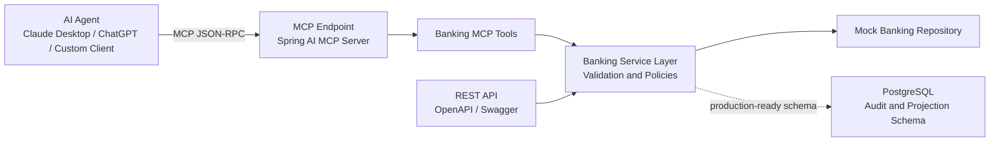

# banking-mcp-server

An open-source MCP Server for Banking. It exposes mock account, payment,
branch, beneficiary, and loan APIs as MCP tools consumable by AI agents.

[](https://openjdk.org/)
[](https://spring.io/projects/spring-boot)
[](https://modelcontextprotocol.io/)
[](LICENSE)

## Why This Exists

Banking teams are beginning to evaluate agentic AI, but safe tool integration
needs deterministic, non-production systems. This project provides a banking
MCP server that looks like real financial infrastructure without touching real
money or customer data.

It reflects patterns from NEFT/RTGS payment systems, Spring Boot
microservices, distributed architecture, API-first design, and responsible MCP
tool exposure.

## Architecture



## MCP Tools

| Tool | Description |
| --- | --- |
| `account_inquiry` | Look up mock account profile details |
| `balance_check` | Check available and ledger balance |
| `transaction_history` | Fetch recent account transactions |
| `neft_payment` | Initiate mock NEFT payment |
| `rtgs_payment` | Initiate mock RTGS payment |
| `beneficiary_management` | Add and validate beneficiaries |
| `payment_status` | Query payment status by UTR |
| `branch_locator` | Find branch and IFSC metadata |
| `loan_eligibility` | Evaluate mock loan eligibility |

## Tech Stack

| Layer | Technology |
| --- | --- |
| Runtime | Java 21 |
| Framework | Spring Boot 3.x |
| Agent Integration | Spring AI MCP Server, MCP Java SDK through Spring AI |
| API | REST, OpenAPI, Swagger UI |
| Data | Mock repository, PostgreSQL schema via Flyway |
| Build | Maven |
| Platform | Docker, Kubernetes |
| CI/CD | GitHub Actions |

## Quick Start

```bash
git clone https://github.com/your-org/banking-mcp-server.git
cd banking-mcp-server
mvn verify
docker compose up --build
```

Application URLs:

- REST API: `http://localhost:8080/api/v1`
- Swagger UI: `http://localhost:8080/swagger-ui.html`
- Tool catalog: `http://localhost:8080/api/v1/mcp/tools`
- Health: `http://localhost:8080/actuator/health`

## Example REST Calls

```bash
curl http://localhost:8080/api/v1/accounts/123456789012/balance
curl "http://localhost:8080/api/v1/branches?city=Mumbai"
```

```bash
curl -X POST http://localhost:8080/api/v1/payments/neft \
  -H "Content-Type: application/json" \
  -d '{
    "debitAccount": "123456789012",
    "beneficiaryAccount": "555544443333",
    "beneficiaryName": "Nisha Rao",
    "ifscCode": "SBIN0004321",
    "amount": 50000.00,
    "remarks": "Invoice settlement"
  }'
```

## Claude Desktop Example

```json
{
  "mcpServers": {
    "banking": {
      "url": "http://localhost:8080/mcp",
      "transport": "http"
    }
  }
}
```

## Project Structure

```text
banking-mcp-server/
├── .github/workflows/ci.yml
├── docs/
│   ├── api.md
│   ├── mcp-tools.md
│   └── prompts.md
├── k8s/
│   ├── deployment.yaml
│   ├── secret.example.yaml
│   └── service.yaml
├── src/main/java/com/banking/mcp/
│   ├── client/
│   ├── config/
│   ├── domain/
│   ├── dto/
│   ├── repository/
│   ├── service/
│   ├── tools/
│   └── web/
├── src/main/resources/db/migration/
├── src/test/java/com/banking/mcp/
├── Dockerfile
├── docker-compose.yml
├── pom.xml
└── README.md
```

## Safety

This repository never connects to real banking rails. All accounts, balances,
branches, beneficiaries, payments, and loan decisions are mock data. Do not put
real account numbers, credentials, OTPs, PAN, Aadhaar, card data, or customer
data into prompts or tests.

## Documentation

- [API documentation](docs/api.md)
- [MCP tool definitions](docs/mcp-tools.md)
- [Example agent prompts](docs/prompts.md)
- [Contributing guide](CONTRIBUTING.md)

## License

MIT. See [LICENSE](LICENSE).
